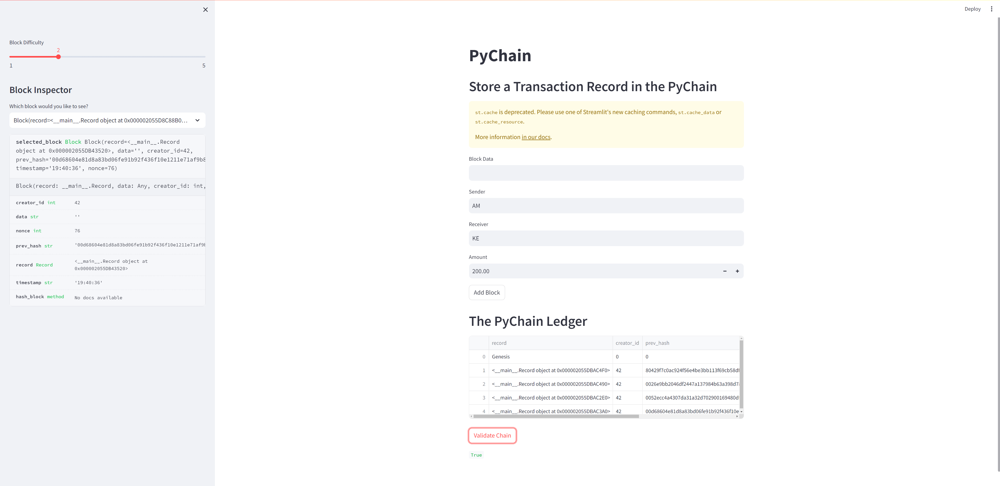

# PyChain Ledger

This project implements a basic blockchain ledger called `PyChain` using Python and Streamlit. The ledger stores financial transaction records, and users can interact with it through a Streamlit web interface.

## Features

- **Record Class**: Defines a `Record` data class to represent transaction records with `sender`, `receiver`, and `amount` attributes.
- **Block Class**: Modifies the existing `Block` data class to store `Record` data.
- **Streamlit Interface**: Provides a user interface to input sender, receiver, and amount for each transaction.
- **Blockchain Validation**: Implements blockchain validation to ensure the integrity of the ledger.

## Usage

1. Run the Streamlit application using `streamlit run pychain.py`.
2. Enter sender, receiver, and amount values and click "Add Block" to store transactions in the ledger.
3. Validate the blockchain using the web interface.

